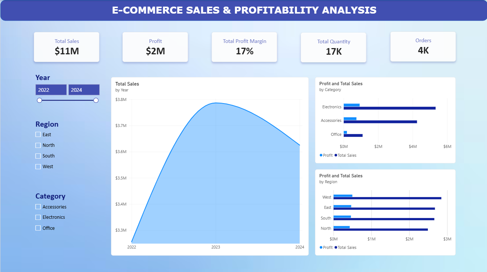
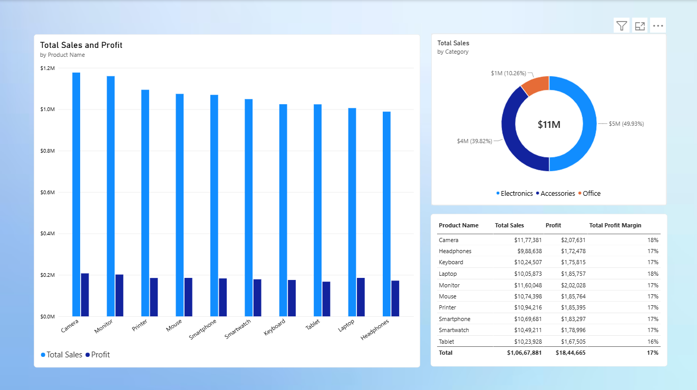
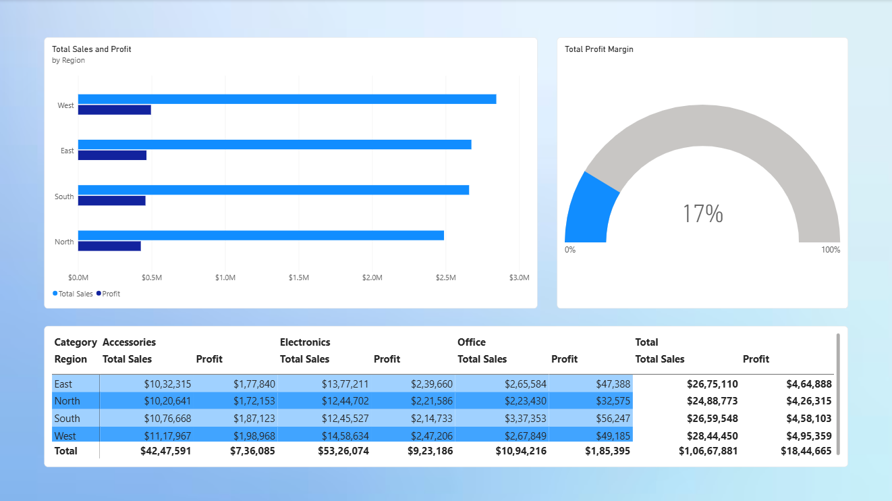

# E-Commerce Sales & Profitability Analysis

An end-to-end data analytics project analyzing **3,500 e-commerce sales records** across **3 product categories and 4 regions** to evaluate sales trends, product performance, regional demand, and profitability.

The project demonstrates a complete analytics workflow covering data understanding, data cleaning, exploratory analysis, SQL analysis, profit-margin analysis, and interactive Power BI visualization.

---

## Project Overview

This project was developed to transform raw e-commerce transaction data into actionable business insights.

The analysis focuses on:

- Sales performance and trends
- Product and category performance
- Regional demand
- Quantity sold
- Profitability
- Profit margins
- Business performance across time

---

## Dataset

The dataset contains **3,500 sales records** with the following fields:

| Column | Description |
|---|---|
| Order Date | Date of the order |
| Product Name | Name of the product |
| Category | Product category |
| Region | Sales region |
| Quantity | Units sold |
| Sales | Sales revenue |
| Profit | Profit generated |

---

## Tools & Technologies

- **Excel** – Data inspection and initial preparation
- **Python** – Data cleaning, feature engineering and exploratory analysis
- **SQL** – Aggregation and business analysis
- **Power BI** – Interactive dashboard and data visualization

### Python Libraries

- Pandas
- NumPy
- Matplotlib

---

## Project Workflow

```text
Raw Dataset
     ↓
Data Understanding
     ↓
Data Cleaning
     ↓
Feature Engineering
     ↓
Exploratory Data Analysis
     ↓
SQL Analysis
     ↓
Profitability Analysis
     ↓
Power BI Dashboard
     ↓
Business Insights
```

---

## Key Analysis Areas

### 1. Sales Analysis

Analyzed sales performance across:

- Time
- Categories
- Products
- Regions
- Quantity sold

### 2. Product Analysis

Evaluated individual product performance using sales, quantity and profit metrics to identify high-performing and underperforming products.

### 3. Regional Analysis

Compared different regions to understand regional sales contribution, demand patterns and profitability.

### 4. Profitability Analysis

Analyzed total profit and profit margins across products, categories and regions to evaluate business performance beyond revenue.

---

## Power BI Dashboard

The Power BI dashboard provides an interactive view of the dataset through multiple analytical perspectives.

### Dashboard Pages

- Overview
- Product Performance
- Regional Sales and Profitablity

### Dashboard Screenshots

#### Overview



#### Product Performance



#### Regional Sales and Profitablity



---

## Repository Structure

```text
E-Commerce-Sales-Profitability-Analysis/
│
├── data/
│   ├── raw/
│   │   └── ecommerce_sales.csv
│   └── processed/
│       └── cleaned_ecommerce_sales.csv
│
├── notebooks/
│   ├── data_understanding_and_analysis.ipynb
│
├── sql/
│   └── analysis_queries.sql
│
├── powerbi/
│   └── ecommerce_sales_dashboard.pbix
│
├── reports/
│   └── project_report.pdf
│
├── screenshots/
│   ├── overview.png
│   ├── product_performance.png
│   ├── regional_sales_and_profitablity.png
│
├── README.md
└── requirements.txt
```

---

## How to Explore the Project

1. Start with the **README** for an overview of the project.
2. Review the **data understanding notebook** to understand the dataset.
3. Open the **data cleaning notebook** to review the cleaning and preparation process.
4. Explore the **EDA notebook** for analytical findings.
5. Review `analysis_queries.sql` to see the SQL analysis.
6. Open the Power BI dashboard to explore the interactive visualizations.
7. Refer to the project report for the overall analysis and conclusions.

---

## Skills Demonstrated

- Data Cleaning
- Data Preparation
- Exploratory Data Analysis
- Feature Engineering
- SQL Aggregation
- Business Analysis
- Sales Analysis
- Profitability Analysis
- Data Visualization
- Dashboard Development
- Power BI
- Excel
- Python

---

## Project Objective

The objective of this project is to demonstrate how raw transactional data can be transformed into meaningful business analysis and interactive dashboards that support data-driven decision making.

---

## Author

**Md Khaleel Ur Rahman**

Data Analyst | Excel | Power BI | SQL | Python
